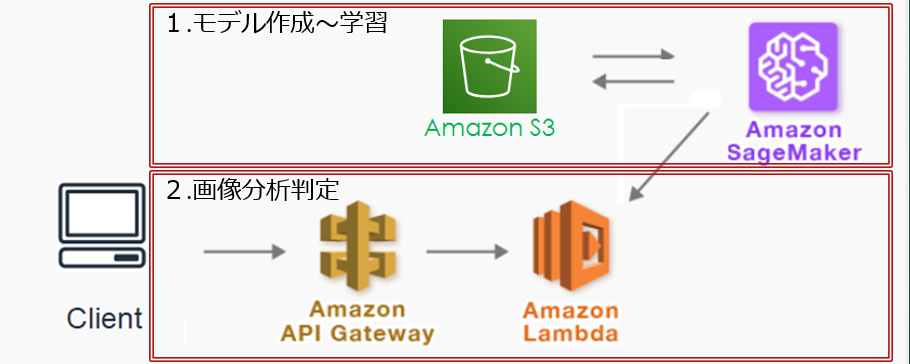
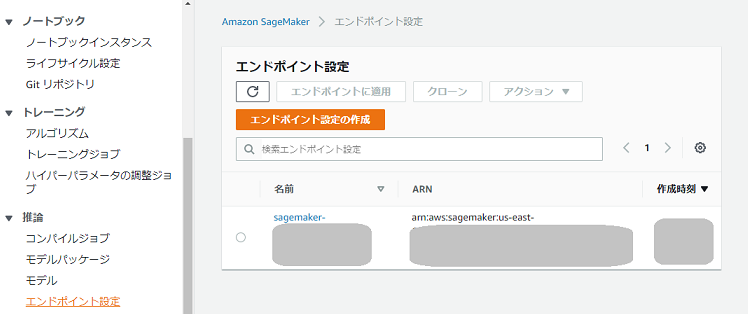
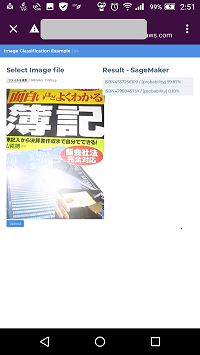

# 書籍の画像認識をやってみた

## 目的（やりたいこと）
  - スマホで撮影した書籍の画像からＩＳＢＮ番号を取得する。
 （取得したＩＳＢＮをシステムの連携キーとして取得可能とする）

## 使用したAWSサービス
|サービス名            |説明                    |
|:--                  |:--                     |
|Amazon SageMaker | サービス内Jupyter notebookを使用し、モデル作成～学習済モデルを利用したに使用 |
|Amazon S3 |SageMakerと連携し、学習済モデルを格納   |
|Amazon API Gateway+Lambda | APIとして画像から学習した特定のISBNに対する結果（確率）を返却 |
##
[](./image.png)

## フォルダ構成
|フォルダ名            |説明                    |
|:--                  |:--                     |
|notebook |Jupyter notebookのソース＋学習元データ |
|image-classification | Lambdaで実行するサーバコード(Python) |
|Test | 画像分析判定を実行するためのフロントアプリ(Vue.js) |

## 概要   
　本内容はあくまでも概要であり、詳細は未記載

 - 1.画像とＩＳＢＮの紐づけ（モデル作成～学習）
     - モデル作成～学習：AWS SageMaker内のJupyter notebook上にある画像分類のサンプル「Image-classification-lst-format」に手を加えを実施
       <br> ソース：[Image-classification-lst-format.ipynb](./notebook/Image-classification-lst-format.ipynb)
     - 学習に使用するデータ：ISBNを画像分類項目とし、各ISBNに対し約100の画像ファイルを用意
       <br> データ：[256_ObjectCategories.tar](./notebook/256_ObjectCategories.tar)[notebook]<br>
       - フォルダ名の「.」以降の文字列で画像分類分け
            ```
            256_ObjectCategories
                ├─001.ISBN479804573X
                │      001_0001.jpg
                │      001_0002.jpg
                │       ～
                │      001_0100.jpg
                │      
                ├─002.ISBN4537256109
                │      002_0001.jpg
                │       ～
                │      002_0100.jpg
                │      
                └─003.ISBN4839964564
                        003_0001.jpg
                        ～
                        003_0100.jpg
            ```

     - SageMakerで学習済みモデルを利用した各分類毎の確率を返却するエンドポイントを作成
       - 作成：[Image-classification-lst-format.ipynb](./notebook/Image-classification-lst-format.ipynb)　4.C.c 「Create endpoint」を実行することにより作成
       - 結果：<br>[](./create-endpoint-result.png)

 - 2.画像分析判定
     - 画像分析判定機能の作成：Cloud9上でChaliceフレームワーク（Python）を使用して新規作成後、app.pyを編集
        ```
        chalice new-project image-classification
        ```
       - [app.py](./image-classification/app.py)
       - [requirements.txt](./image-classification/requirements.txt)

     - デプロイ：コマンドを実行
        ```
        chalice deploy
        ```
        - 実行結果にAPIのURLが表示される
     - 画像分析判定機能の呼び出しテスト
       - 以下のテスト用フロントアプリから呼び出し
         - [index.html](./Test/index.html)
         - [main.js](./Test/main.js)
       - 判定結果：99.87%<br>
       [](./test3.png) 
       

## 苦労したポイント
 - 学習する際に使用したサンプルはGPUを必要とするが、SageMakerで利用できるGPUのデフォルトインスタンス数の制限が1であり、途中でエラーとなる
   - インスタンス数の制限という原因までたどり着くのに時間がかかった
   - 制限はAWS管理コンソールから設定変更できない
   - サポートに上限緩和制限申請が必要。英語フォームであり少し敷居が高い
     - 英語で申請したが返信は日本語（バージニアリージョンの設定変更なのに日本で対応？）
     - 返信まで約2日くらい？ 

 - SageMakerで試行錯誤中の日々は費用が500円/日発生
   - エンドポイントの公開だけで課金されるので、常時起動は厳しいことが分かった・・・
